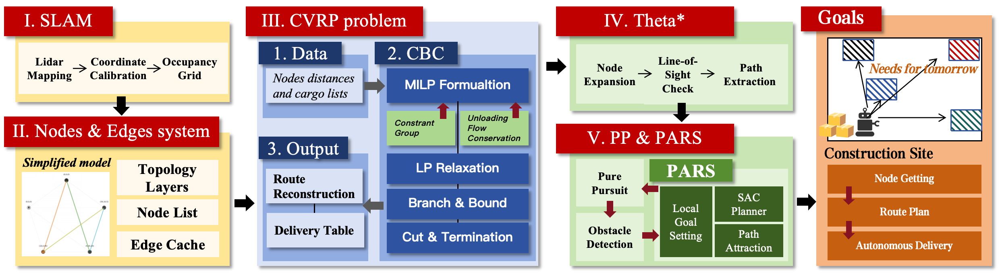
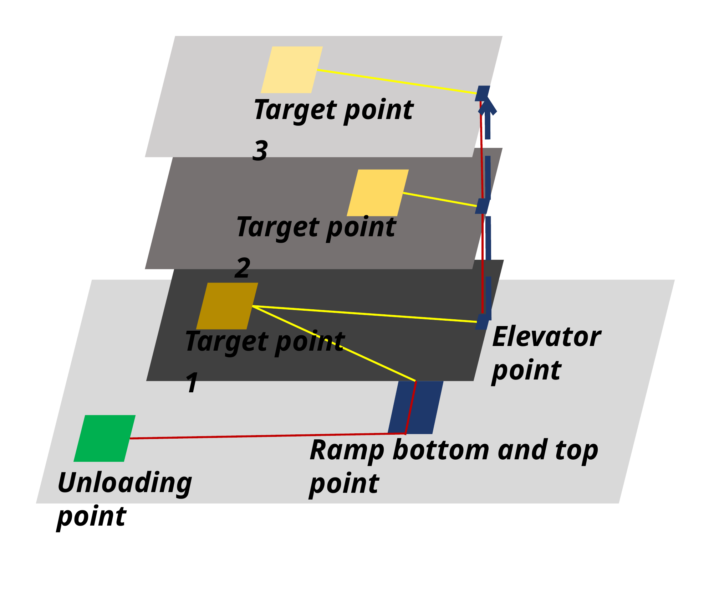
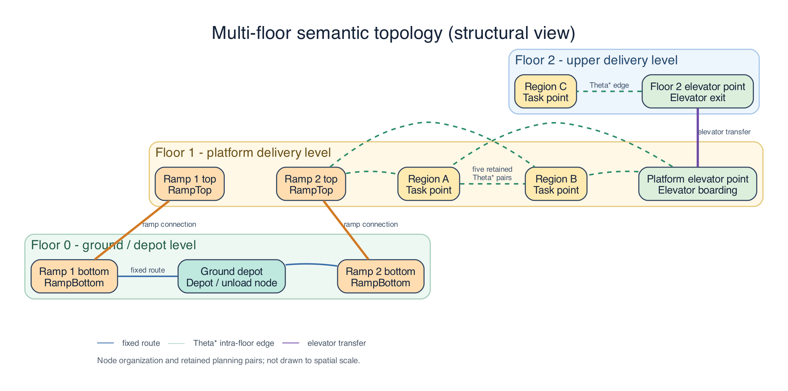
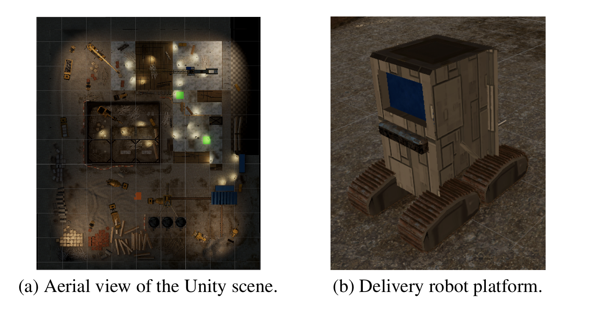
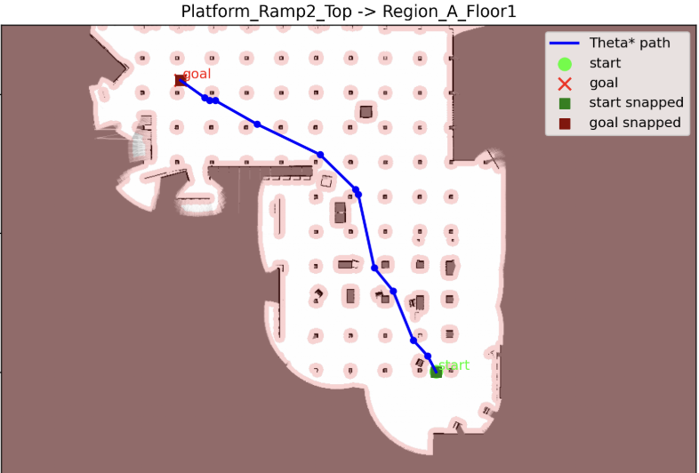
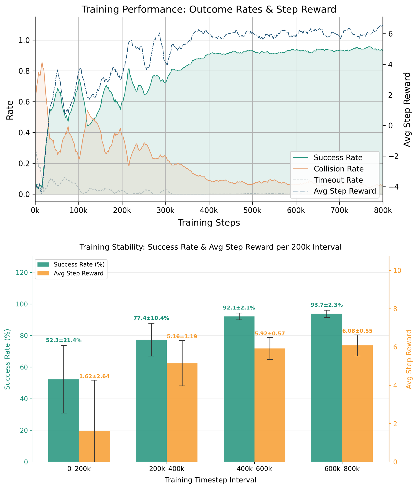
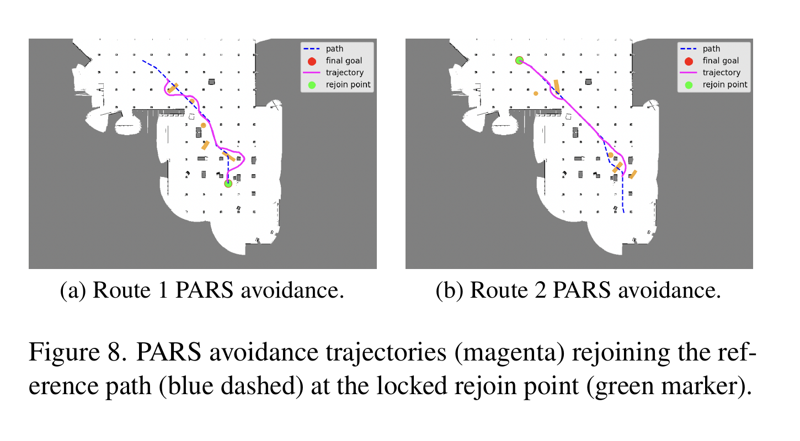

# Autonomous Delivery Robot System

*Research project on multi-floor autonomous material delivery for construction-site logistics.*

**Multi-floor topology · Unity simulation · Delivery optimization · RL-based local recovery**

This study implements a Unity-based autonomous delivery framework for construction-material transport across multiple floors. The system integrates LiDAR mapping, semantic topology, Theta* planning, capacity-constrained delivery scheduling, waypoint generation, and robot execution, alongside a Python study of reinforcement-learning-based local path recovery.

**System flow:** Theta* paths → merged topology → Dijkstra task distances → CVRP scheduling → waypoint expansion → Unity execution.

The architecture combines a Unity-based multi-floor delivery pipeline with a Python PARS study of local path recovery. Together, they connect task-level logistics, geometric planning, robot execution, and learned recovery within one research agenda.

## System Components

Construction delivery requires more than finding a short path. A robot must transport different material types within its capacity, return to a depot for reloading, reach work areas on different floors, and convert delivery decisions into executable motion. A local obstruction also raises a separate control question: how can the robot recover toward its reference route without replacing the entire planning stack?

The project focuses on three connected parts of that problem:

- **Multi-floor representation:** a typed node-edge graph connects delivery regions, ramp endpoints, elevator points, and the depot, while retaining the geometry needed for execution.
- **Delivery formulation and execution:** a multi-trip, multi-commodity mixed-integer model connects loading and unloading decisions to route selection; its output becomes movement and dwell commands for Unity.
- **Local recovery control:** the Python PARS module combines nominal Pure Pursuit, blockage-triggered SAC actions, and a locked forward rejoin target.

## Multi-floor Topological Node System

The topology bridges scene geometry and task-level optimization. Instead of scheduling directly over every occupancy-grid cell, the system represents locations with operational meaning:

| Level | Nodes and roles |
|---|---|
| Ground / Floor 0 | Depot and two ramp-bottom nodes |
| Platform / Floor 1 | Two ramp-top nodes, delivery regions A/B, and elevator boarding point |
| Upper level / Floor 2 | Elevator exit and delivery region C |

The presentation schematic organizes the unloading point, three delivery targets, ramp endpoints, and elevator point across stacked levels. It illustrates how operational locations and vertical transitions are represented; the visible links are schematic rather than a complete adjacency graph.

**Edges carry both cost and executable geometry.** Fixed edges store three-dimensional waypoint sequences for known corridors and ramps. Theta* generates selected intra-floor connections on occupancy maps after obstacle inflation. Elevator transfer edges connect boarding and exit nodes.

Dijkstra search over the merged edge cache produces task-to-task distances. After scheduling, the chosen task sequence is expanded through that same cache into physical waypoint paths. This translation—from semantic tasks to geometric routes—is the central role of the topology system.

## Task-level Delivery Optimization

A single robot makes repeated depot-return trips while carrying multiple goods. The mixed-integer formulation includes trip-indexed route and activity variables, explicit customer unloading quantities, commodity flows, demand fulfillment, capacity constraints, and subtour elimination. These constraints tie the delivery quantities to the routes used to transport them.

CBC, accessed through OR-Tools, minimizes total travel distance. The project applies a construction-delivery formulation and connects its output to the navigation pipeline; CVRP and the solver are established methods. The optimized trips are expanded into ordered movement commands and timed waits for elevator use and unloading.

## Unity Simulation and Delivery Execution

The Unity simulation represents a three-level construction site with a ground depot, two ramps, an elevator, and three randomized delivery regions. Regions A and B are generated on the platform level with separation constraints, while region C is placed on the upper floor. This creates repeated delivery tasks with changing destinations and cross-floor route requirements.

Unity serves as the execution environment for the planned trips. The C# modules provide multi-height planar LiDAR, UDP sensor transmission, topology and target export, waypoint loading, and Rigidbody-based Pure Pursuit control. Critical-waypoint handling guides the robot into elevator boarding positions; trigger logic coordinates platform motion and exit; tagged wait commands represent elevator operation and unloading dwell time. Ramp segments retain three-dimensional waypoint geometry, allowing Pure Pursuit to execute changes in elevation as part of the route.

Python supplies the complementary planning stages: occupancy mapping, topology processing, Theta* paths, graph distances, CVRP scheduling, and waypoint generation. The final flat waypoint stream returns to Unity as an ordered sequence of motion and dwell commands. In the manuscript evaluation, five runs of 20 deliveries produced 100/100 completed deliveries and a mean round-trip time of 223 seconds.

## Representative Planning Output

This project-generated example shows a Theta* path from `Platform_Ramp2_Top` to `Region_A_Floor1`, with original and snapped endpoints. It illustrates how occupancy thresholding, obstacle inflation, endpoint snapping, and any-angle search produce the sparse waypoint geometry stored for an intra-floor topology edge.

## Reinforcement Learning for Local Recovery: PARS

**PARS — Path-Attentive Recovery SAC — studies recovery around a supplied reference route in a Python simulation.** Pure Pursuit provides nominal tracking. When a geometric line-of-sight check detects a blocked forward reference, SAC supplies local linear and angular velocity commands. When reconnection becomes feasible, a forward rejoin target is locked before nominal tracking resumes.

The observation has 29 dimensions: 21 simulated LiDAR ranges plus goal, return-point, tracking-error, heading, and velocity features. The research focus is the switching and rejoin design around established control and RL methods, rather than replacing the global planner with SAC.

*Source: `Jingxuan_Duan_Independent_Study_V2.pdf`, Figure 6, page 6. Results are summarized over successive 200k-step intervals in the 800k-step presentation.*

Training success rises while collision and timeout rates decline, with performance reaching an approximate plateau after 400k steps. In the 600k–800k interval, the reported success rate is **93.7 ± 2.3%**. The step-reward curve and interval summaries show how the recovery policy develops across the training sequence.

The two representative trajectories show PARS steering around local obstacles and returning to the dashed reference route at a locked rejoin point. They visualize the recovery-and-reconnection behavior used alongside nominal Pure Pursuit tracking.

## My Role

Role: Independent Study researcher. Responsibilities included problem definition, system architecture, optimization formulation, Python and Unity implementation, simulation experiment design, analysis, and manuscript preparation.

Theta*, Dijkstra search, Pure Pursuit, SAC, CBC/OR-Tools, Gymnasium, and LiDAR occupancy-mapping methods are established building blocks. The project work covered their configuration and integration through the delivery formulation, topology, module interfaces, and recovery logic.

## Repository Structure

- `src/python/`: mapping, topology, planning, optimization, waypoint generation, and the PARS environment/evaluator.
- `src/unity/`: sensing, semantic nodes, navigation, robot control, elevator interaction, and delivery targets.
- `docs/`: [research manuscript](docs/Autonomous_Delivery_Robot_System.pdf).
- `figures/`: architecture diagrams, planning outputs, and PARS training and recovery results used on this page.

This portfolio focuses on research design, selected implementation modules, and simulation results. It is a curated research portfolio rather than a packaged Unity application, and the reported evaluation is simulation-based.

## Contact

Jingxuan Duan 
Carnegie Mellon University 
Email: shureduan0912@gmail.com
